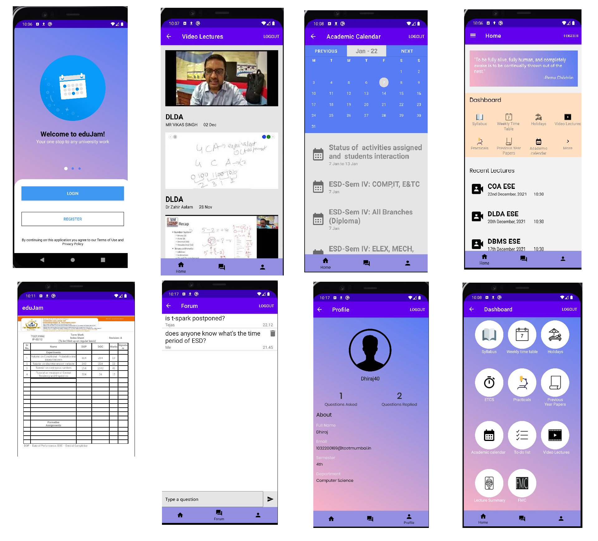

<h1 align="center">eduJam - Your one-stop to any university work</h1>

eduJam is a university app, which will help you with all of your university work. It has features which allow you to see the syllabus for the ongoing semester, weekly, academic and holiday time-table, to-do list, recent video lectures with respectives notes in a pdf form. We also have Fill my Cycle feature which helps in making the index for students under 2 minutes.
The app also includes a forum where all students can have a talk about any doubts.
To use eduJam, You will need a eduJam account* first, which you are going to use in this app.

Note: Currently eduJam is specifically for TCET students only.  
     
## Why its needed:
Many issues have been occurred for students while learning online over time, whether it is a lack of effective communication between teachers and us or a lack of a proper one-stop for all of their work.
One of the challenges we face every day is to find lecture notes to study from, for the exams. The FAQ of a student is:- "Where is the zoom link?", "Whats the syllabus?", "Where are the recorded lectures?", are all solved by our application. It also makes bulky and boring tasks like making the indexes extremely easy.

## What it does :
This project "eduJam" proposes “one-stop for all university needs” to keep track of the college activities and student's learning and provides all the information about all of the syllabus, and timing of lectures, the one app where you have everything college related. It's features include having content like recorded lectures, notes, and modules, amd a very simple and automated FillMyCycle feature. It accepts student data allowing them to register to the application. This application has forums which allows the students to communicate with each other and collaborate or solve each others doubts extremely fast. Currently the app works for 2024 batch TCET students only. The project's scope is to extend it for other year batch students to allow for wider use and more universal appeal

### Screenshots

### Demo Video
Click on the video to go to see the demo of our app 

## 👇 Prerequisites

Before installation, please make sure you have already installed the following tools:
- [Git](https://git-scm.com/downloads)
- [Android Studio](https://developer.android.com/studio)

## 🛠️ Installation Steps
1. Fork the project
2. Clone the project
3. Create a new branch (`git checkout -b new-feature`)
4. Make the appropriate changes in the files (` git add . `)
5. Add changes to reflect the changes made (`git commit -m 'commit message'`)
6. Push to the branch (` git push `)
7. Create a Pull Request

## 📱 Test Credentails
1. If you already have tcet id, we recommend using it
2. Test credentials:
   - email - test@tcetmumbai.in
   - password - eduJam
 
## 👨‍💻 Contributing

- Any contributions you make are **greatly appreciated**.
- Before contributing, Please Check out our [contribution guidelines](https://github.com/CerritusCodersComm/eduJam/blob/main/CONTRIBUTING.md) for more information.

### Bug / Feature Request

If you find a bug in our app, kindly open an issue [here](https://github.com/CerritusCodersComm/eduJam/issues/new) by including a proper description about the bug and the expected result.
Similarly we would be glad to hear about new features to add in our app, kindly follow same procedure for it too.

## Functionality & Concepts used

- The App has a very simple and interactive interface which helps the students in checking syllabus, notes, recent lectures etc. Following are few android concepts used to achieve the functionalities in app :
- [Android's MVVM Structure](https://developer.android.com/jetpack/guide)
- [Navigation Package](https://developer.android.com/reference/androidx/navigation/package-summary)
- Navigation Component including [set of principles](https://developer.android.com/guide/navigation/navigation-principles).
- [View Binding](https://developer.android.com/topic/libraries/view-binding)
- LiveData & Room Database
- [Firebase Authentication](https://firebase.google.com/docs/auth)
- [Firebase Firestore](https://firebase.google.com/docs/firestore)
- [Firebase Cloud Messaging](https://firebase.google.com/docs/cloud-messaging)
- [Heroku](https://www.heroku.com/) is used to host the REST API used to send notifications.
- [Lottie Animations](https://airbnb.io/lottie/#/)

## 🛡️ License
eduJam is licensed under the MIT License - see the [`LICENSE`](LICENSE) file for more information.

## Application Link & Future Scope :
Talking about the usability of the app, you can try out beta version for now from [here](https://github.com/cdhiraj40/eduJam/blob/main/app/release/app-release.apk) or [here](https://drive.google.com/file/d/1reBSs83vkvdV73bD6lNm_oGxRxU8HQ4v/view?usp=sharing).

About the future usage of our app, we plan to make it accessibale to every student in our university. We are also thinking of collaborating with teachers and with neighboring colleges to propose this app idea and collaborate with them. We aim that once students will start using the app, we will be able to make it way better than what it is now. Also we have planned many features for are app so that it can be made more robust and user friendly.

## 🙏 Support
Do ⭐️ the project if you like it :)

## Join us
If you would like to join us in discussions for the project, you can join our [discord server](https://discord.com/invite/fKakn9kk39)
